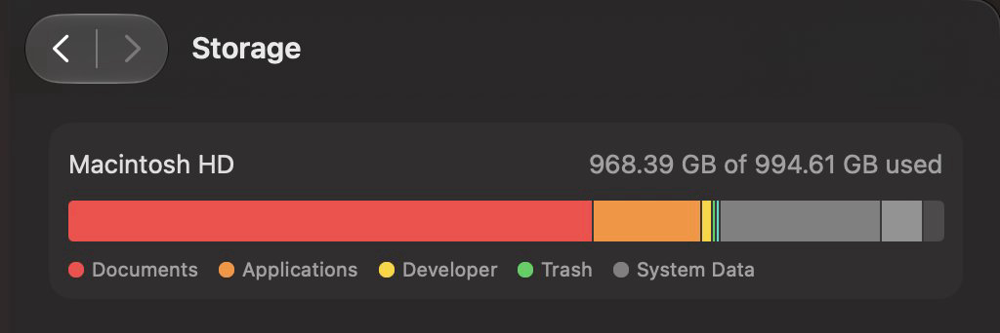
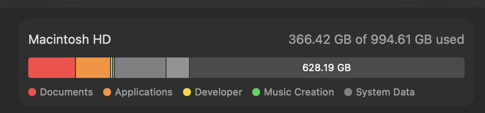

# Storage Rescue

An instruction-only Agent Skill that frees up storage on a Mac without losing data. It gives an AI agent two ways to work: move your big files to an external drive and verify them before deleting anything, or, with no drive, delete only caches and the things you say you no longer want. The agent asks before every move and every deletion.

Version 1.0.0. MIT license. Maintained by Da7-Tech.

## Before and after

One session with the skill on a 1 TB Mac, using both modes:

**Before:** 968.39 GB of 994.61 GB used.



**After:** 366.42 GB used, 628.19 GB free.



## Why this exists

A full Mac is rarely full of caches. The space usually sits in large things: old projects, AI models, movies and recordings, installers, backups, chat histories, simulator runtimes. Most cleanup tools only clear caches, and the ones that go further tend to decide on their own what you do not need.

Storage Rescue tells the agent how to go after the large things safely. It surveys first, explains what it found, asks you what to do with each group, and only then acts. Nothing leaves the Mac until a verified copy exists, and nothing is deleted without your answer.

It is plain text: a `SKILL.md` plus reference files the agent loads when it needs them. There is no runtime, no script to install, and no network call of its own. You hand it to your agent and the agent follows it.

## Two modes

The agent's first question picks the mode: do you have an external drive to move files to?

- **Offload (you have a drive).** Large, rarely used files are copied to the drive and compared by SHA-256 twice, once right after copying and again after the drive is unmounted and mounted again. Only then is the Mac copy deleted. Every move is recorded in a manifest on the drive, next to a plain-text README that says what went where and how to restore it. Works with APFS, exFAT, FAT32, and NTFS drives (NTFS through the free, open-source [anylinuxfs](https://github.com/nohajc/anylinuxfs) on Apple Silicon, or a driver you already have).
- **Reclaim (no drive).** Nothing is moved; what goes is deleted. That means caches and build output that programs rebuild on their own, cleared with each tool's official command, plus anything you decide you no longer want. Your personal files go through the Trash first, and emptying it is your last confirmation.

Both modes can run in one session: offload your files, then reclaim caches.

## How it works

1. **Questions first.** Drive or no drive, what must stay on the Mac, which kinds of files are open for discussion.
2. **Read-only survey.** The agent measures where the space went, including "System Data", and changes nothing.
3. **Grouped questions with options.** Findings come back as a few short questions by category, each with sizes and choices such as move to the drive, delete, or keep, using your agent's question tool. The agent marks what it recommends and why.
4. **Action only on your answers.** Anything you did not approve is left alone. If something new turns up along the way, the agent stops and asks again.
5. **Check and report.** Apps whose data changed are reopened to confirm they still start and you are still signed in. Free space before and after is measured, not estimated.

## Safety model

- Silence, a skipped question, or "just delete the junk" is not approval. The agent shows what it found and gets a specific yes.
- In Offload mode, a source is deleted only after every copied file matched twice, the source is unchanged since it was copied (re-hashed right before deletion), and only the entries that were verified are deleted. Anything else stays and is reported.
- Extended attributes, Finder tags, and ACLs are not carried to the drive. The agent checks every source for them first and keeps items on the Mac unless you accept the loss.
- Official routes first: `brew cleanup`, `npm cache clean`, `xcrun simctl`, in-app "Clear cache" screens.
- Paths referenced by your shell profile, launch agents, or app configs are kept.
- Photos, Mail, Messages, Keychains, SSH keys, credentials, and system folders are protected: the agent leaves them alone unless you make a specific, informed request. A `.git` folder is never deleted on its own; in Offload mode it only moves inside a verified archive of its whole project.
- No `sudo` from the agent. When a step needs it, you get the exact command to run yourself.

## Install

The skill is the `skills/storage-rescue/` folder: one `SKILL.md` plus the reference files it links to. Installing means putting a copy of that folder where your agent looks for skills.

With the Skills CLI, from your project:

```
npx skills add Da7-Tech/storage-rescue
```

Add `-g` to install at user level instead of in the current project.

Manual install: copy the whole `skills/storage-rescue/` folder, including `references/`, into the directory your agent reads. Copying only `SKILL.md` is not enough, because it links to the other files.

| Agent | Project directory | User directory |
| --- | --- | --- |
| Claude Code | `.claude/skills/storage-rescue/` | `~/.claude/skills/storage-rescue/` |
| Codex | `.agents/skills/storage-rescue/` | `~/.agents/skills/storage-rescue/` |
| Cursor | `.agents/skills/storage-rescue/` or `.cursor/skills/storage-rescue/` | `~/.cursor/skills/storage-rescue/` or `~/.agents/skills/storage-rescue/` |
| Factory Droid | `.factory/skills/storage-rescue/` | `~/.factory/skills/storage-rescue/` |
| Devin CLI | `.devin/skills/storage-rescue/` | `~/.config/devin/skills/storage-rescue/` |
| Hermes Agent | `.hermes/skills/storage-rescue/` | `~/.hermes/skills/storage-rescue/` |

Agents change their paths from time to time; if the skill is not discovered, check your agent's current documentation.

To read the skill without installing anything, open [SKILL.md](skills/storage-rescue/SKILL.md). It is the same text the agent gets.

## Use

Ask in your own words, in any language:

> My Mac is full. I have an external drive. Use Storage Rescue to move old things there safely.

> No drive. Use Storage Rescue and free as much space as you safely can.

> What is this huge "System Data" on my Mac, and can any of it go?

## What is in this repository

```
skills/storage-rescue/
├── SKILL.md                         workflow, rules, and when to ask
└── references/
    ├── offload-protocol.md          verified copy, archives, manifest, reference implementation
    ├── external-drives.md           file systems, NTFS writing, testing, safe eject
    ├── reclaim-catalog.md           what can go, with which command, under which condition
    ├── app-data.md                  chat databases, messenger caches, VMs, models
    └── system-data.md               what "System Data" is made of
assets/                              the before and after screenshots above
```

## Limits

- macOS only.
- Offload mode leaves a single copy on the external drive. Keep a second backup of anything irreplaceable.
- Some steps need you: running a `sudo` command, approving a macOS privacy prompt, or pressing a button inside an app.
- Sizes from `du` can overstate what deletion frees (APFS clones, purgeable space), so the report uses `df` for before and after.

## License

MIT. See [LICENSE](LICENSE).
